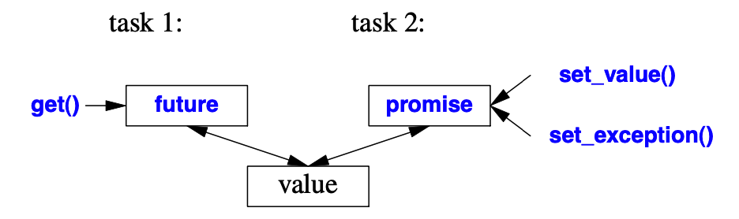
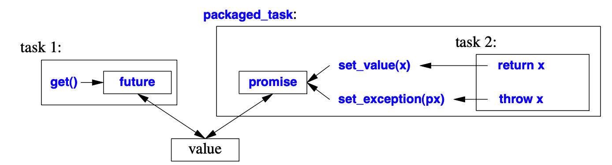

---
---

<!-- vim-markdown-toc GFM -->

* [std::thread](#stdthread)
* [future 和 promise](#future-和-promise)
* [packaged_task](#packaged_task)
* [async](#async)
* [总结](#总结)
* [参考文献](#参考文献)

<!-- vim-markdown-toc -->

上次系统介绍了C++的内存模型，今天接着介绍C++提供的并发编程接口。主要有下面几种方式：
```
1. std::thread; // #include <thread> 
2. std::promise<T>; // #include <future>
3. std::packaged_task<F>; // #include <future>
4. std::async. // #include <future>
```

第2～4种方式都在`<future>`头文件中定义，这是因为它们都通过`future`在任务之间传输值。下面会详细介绍。

### std::thread

在C++中，创建新线程开启一个新的并发任务最简单的方式就是使用`std::thread`:
```c++
#include <iostream> 
#include <thread>

void task1 (int arg) {
    printf("task%d code here...\n", arg);
}

struct task2 {
    void operator()(int arg1, int arg2) {
        printf("task%d code here...\n", arg1);
    }
};

int main() {
    std::thread t1(task1, 1);
    std::thread t2(task2, 2, 3);

    // NOTICE! 
    t1.join();
    t2.join();

    return 0;
}
```

std::thread 在构造的时候传入任何可调用体，接着转入可调用体相应的参数。注意，为了使创建的线程与主线程之间的行为正常避免相互干扰，我**必须**显示join或者detach新创建的线程。join的意思是等待线程执行完任务，离开其局部栈空间，类似Linux父进程等待子进程的[`wait(2)`](https://man7.org/linux/man-pages/man2/wait.2.html)。detach的意思是和主线程分离，这里有许多坑要注意：

- 要保证新线程在使用主线程空间的变量时，该变量没用离开其栈空间。也就是说，主线程detach后如果离开了其栈空间，其上变量被销毁之后，新线程再访问主线程的变量会导致未定义行为；
- detach之后，如果新创建的线程有主线程的引用，还可能影响后续主线程的栈空间，表现为，其栈上的变量无缘无故就被修改。

举一个简单的例子：
```c++
#include <thread>
#include <iostream>

void f(int& ri) {
    while(true) {
        ri = 9;
    }
}

int main() {
    int i = 10;
    int& ri = i;
    std::thread t(f, std::ref(ri));
    t.detach();
    i = 100;
    std::this_thread::sleep_for(std::chrono::seconds(1));
    // print 9
    printf("%d\n", i);
}
```

最终输出9，也就是说即便detach之后，新线程也可能影响主线程的行为，这是一个大坑，要注意。

我们注意到，虽然`std::thread`用起来直观又方便，但是如果我们想在主线程接收新线程任务的返回值，那该怎么办呢，我们可能得自己创建共享数据，还得保证线程安全和数据的同步，实在是不方便。我的意思是，如果我们想要与线程任务进行通信或者数据传输，`std::thread`是很麻烦的。所以有了其他并发编程接口，用来弥补`std::thread`在任务通信方面的不足。

本质上，要完成任务间的通信，需要在新线程创建的时候让线程库给我们添加一个共享的状态，主线程和新线程通过这个共享状态的句柄进行通信。主线程下，这个句柄就是**future**，新线程下，这个句柄就是**promise**

### future 和 promise

为了完成任务间的通信，任务所在线程将结果放入`promise`，需要这一结果的线程就从该任务对应的`future`上进行提取，如图：


这里的value就是task1线程和task2线程间的一个共享状态。task2通过`set_value()`或`set_exception()`传递值，task1通过`get()`获得值。简单的示例代码：
```c++
#include <thread>
#include <iostream>
#include <future>

void f(std::promise<int> prom) {
    prom.set_value(5);
}

int main() {
    std::promise<int> prom;
    std::future<int> fut = prom.get_future();
    std::thread t(f, std::move(prom));
    // print 5
    printf("%d\n", fut.get());
    t.join();

    return 0;
}
```

上面代码打印数值5，完成了一次任务线程间的信息通信。 

### packaged_task

本质上，packaged_task就是对future和promise的一层封装，用于简化任务线程间信息通信。如图：

也就是说一个packaged_task，就像下面这样执行任务：
```c++
// int f (args);
// promise<int> pr;
try {
    pr.set_value(f(args));
} catch {
    pr.set_exception(current_exception());
}
```

简单示例代码如下：
```c++
#include <thread>
#include <iostream>
#include <future>

int f(int arg) {
    return arg + 1;
}

int main() {
    std::packaged_task<int(int)> task(f);
    std::future<int> fut = task.get_future();
    std::thread t(std::move(task), 4);
    printf("%d\n", fut.get());
    t.join();

    return 0;
}
```

上述代码输出5。可以看到，主线程可以得到其他线程任务的返回值。

### async

通过packaged_task可以获取其他并行任务的返回值，即在其他线程调用任务，而在主线程获取任务的结果。**async**同样可以做到这一目的，不同的是，通过async运行任务不需要自己手动创建新线程，`async`通过线程库根据当前系统资源情况创建线程运行任务，返回一个future。也可以选择不创建，在调用future的get接口时在同一个线程运行任务。async到底创不创建线程由当前系统情况和线程库决定。示例代码如下：
```c++
#include <thread>
#include <iostream>
#include <future>

int f(int arg) {
    return arg + 1;
}

int main() {
    auto fut = std::async(f, 4);
    printf("%d\n", fut.get());

    return 0;
}
```
上述代码同样输出5。

当然我们也可以手动指定让async创建新线程运行任务：
```
auto fut = std::async(std::launch::async, f, 4);
```

### 总结

可以看到，C++提供的几种并发接口均有自己适用的场景，如果任务间没有联系，就直接使用`std::thread`。如果需要任务间传输数据，应配合使用`promise`或`packaged_task`，然后用`future`获取结果。如果想要让系统灵活决定要不要创建新线程运行任务，可以直接使用`std::async`。这些接口越来越上层，用起来越来越方便。

### 参考文献

- [C++程序设计语言](https://book.douban.com/subject/26857943/)

- [C++并发编程实战](https://book.douban.com/subject/26)
