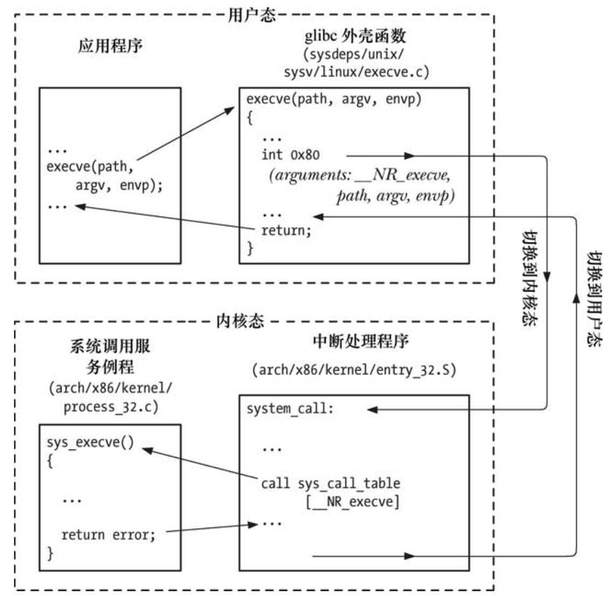
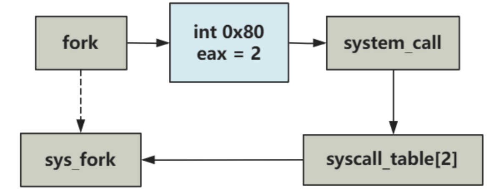

<!-- vim-markdown-toc GFM -->

* [系统调用及其作用](#系统调用及其作用)
* [系统调用过程](#系统调用过程)
  * [整体过程概述](#整体过程概述)
  * [从源码看看fork(2) 的实际调用过程](#从源码看看fork2-的实际调用过程)
  * [sys_call的全貌](#sys_call的全貌)
* [问题](#问题)
  * [为什么系统调用的时候是先到内核中再保存寄存器信息到内核栈，而不是在系统调用准备的时候保存在用户栈？](#为什么系统调用的时候是先到内核中再保存寄存器信息到内核栈而不是在系统调用准备的时候保存在用户栈)
* [参考文献](#参考文献)

<!-- vim-markdown-toc -->

### 系统调用及其作用

系统调用本质上是让程序从用户态转为内核态，让操作系统内核执行一些用户无法执行的任务比如操作硬件、修改内核缓冲区内容。再说直白一点，系统调用就是让指向用户代码区的程序计数器（具体就是CS段寄存器和IP寄存器）修改为指向内核代码区相应系统调用代码处，即当前程序计数器从用户代码区跳转到内核代码区。

一般而言，内核区是受CPU保护的，用户不能直接进行跳转。也就是说内核代码和用户代码属于不同的特权级，不能直接跳转，必须通过处理器提供的特殊指令进行间接跳转。系统调用本质上就是通过执行一个中断指令`INT 0x80`进行跳转的（Intel还提供sysenter指令，可以更快进行用户态到内核态的跳转）。下面将详细介绍系统调用的具体过程。

### 系统调用过程

#### 整体过程概述
一般而言，用户都是通过一个wrapper函数进行系统调用的，所谓的wrapper函数功能就是在执行用户态到内核态跳转前做一系列准备，所以一个典型的系统调用过程如下：

1. 通过调用C语言函数库wrapper函数发起系统调用。在wrapper函数中，先检查系统调用的参数是否可用，如果可用，将这些参数存入到寄存器中，同时为了区分不同的系统调用，根据系统调用名将系统调用编号复制到CPU的`rax`寄存器中。

2. 准备好之后，wrapper函数执行中断指令`INT 0x80`（或sysenter）引发CPU从用户态切换到内核态，本质上就是修改程序计数器到内核代码区。然后执行中断处理函数（`0x80`指定的代码）sys_call()。

3. 在sys_call()中，首先将寄存器的值保存到内核栈。接着检查系统调用参数（如果有）、系统调用编号的有效性，根据该编号对系统调用表（`sys_call_table`）进行索引，然后调用相应的系统调用服务例程，执行相应的任务，例如对内核数据进行修改、与用户区传输数据、I/O操作等等。之后将处理结果进行返回。

4. 系统调用服务例程返回到sys_call()后，从内核栈恢复寄存器的值，服务例程的返回值置于栈中。

5. 从内核态切换到用户态， 回到wrapper函数中。wrapper函数检查系统调用的返回值，若为负数，将会设置errno全局变量。

整个过程示意图如下：


#### 从源码看看fork(2) 的实际调用过程

fork(2)的wrapper函数定义如下：

```c
// 0 表示0个参数
#define _syscall0(type,name) \
type name(void) \
{ \
    volatile long __res; \
    _asm { \
        _asm mov eax,__NR_##name \
        _asm int 80h \
        _asm mov __res,eax \
    } \
    if (__res >= 0) \
        return (type) __res; \
    errno = -__res; \
    return -1; \
}
```

可以看到，该wrapper函数在执行`int 80h`中断指令前，将__NR_##name（这里就是__NR_fork，对应编号为2）存入了寄存器eax（32位处理器），执行完系统调用后，将返回值保存到栈中，如果为负数，设置errno全局变量。

接下来看看，`0x80`中断处理函数，它在操作系统初始化的时候被设置：
```c
set_system_gate(0x80, &system_call);
```
这里的system_call对应汇编代码：
```assembly
_system_call:
    ...
    call [_sys_call_table + eax*4]
    ...
```
fork对应的eax为2，在`sys_call_table`中找到函数`sys_fork`进行调用，其定义为：
```assembly
_sys_fork:
    call _find_empty_process
    testl %eax,%eax
    js 1f
    push %gs
    pushl %esi
    pushl %edi
    pushl %ebp
    pushl %eax
    call _copy_process
    addl $20,%esp
1:  ret
```

这里就是一个系统调用的最底层。上述调用关系如图：


fork(2)系统调用没有参数，如果有参数，例如execve(2)，则其wrapper函数为：
```c 
execve("/bin/sh",argv_rc,envp_rc);

_syscall3(int,execve,const char *,file,char **,argv,char **,envp)

#define _syscall3(type,name,atype,a,btype,b,ctype,c) \
type name(atype a,btype b,ctype c) { \
    volatile long __res; \
    _asm { \
        _asm mov eax,__NR_##name \
        _asm mov ebx,a \
        _asm mov ecx,b \
        _asm mov edx,c \
        _asm int 80h \
        _asm mov __res,eax\
    } \
    if (__res >= 0) \
        return (type) __res; \
    errno = -__res; \
    return -1; \
}
```
 可以看到，除了多了将参数存入寄存器其他都一样。实际上，根据系统调用参数的个数，操作系统定义了许多宏：
```c 
#define _syscall0(type,name)
#define _syscall1(type,name,atype,a)
#define _syscall2(type,name,atype,a,btype,b)
#define _syscall3(type,name,atype,a,btype,b,ctype,c)
```

#### sys_call的全貌

sys_call中断处理函数的全貌如下：
```assembly
_system_call:
    cmpl $nr_system_calls-1,%eax
    ja bad_sys_call
    push %ds
    push %es
    push %fs
    pushl %edx
    pushl %ecx      # push %ebx,%ecx,%edx as parameters
    pushl %ebx      # to the system call
    movl $0x10,%edx     # set up ds,es to kernel space
    mov %dx,%ds
    mov %dx,%es
    movl $0x17,%edx     # fs points to local data space
    mov %dx,%fs
    call _sys_call_table(,%eax,4)
    pushl %eax
    movl _current,%eax
    cmpl $0,state(%eax)     # state
    jne reschedule
    cmpl $0,counter(%eax)       # counter
    je reschedule
ret_from_sys_call:
    movl _current,%eax      # task[0] cannot have signals
    cmpl _task,%eax
    je 3f
    cmpw $0x0f,CS(%esp)     # was old code segment supervisor ?
    jne 3f
    cmpw $0x17,OLDSS(%esp)      # was stack segment = 0x17 ?
    jne 3f
    movl signal(%eax),%ebx
    movl blocked(%eax),%ecx
    notl %ecx
    andl %ebx,%ecx
    bsfl %ecx,%ecx
    je 3f
    btrl %ecx,%ebx
    movl %ebx,signal(%eax)
    incl %ecx
    pushl %ecx
    call _do_signal
    popl %eax
3:  popl %eax
    popl %ebx
    popl %ecx
    popl %edx
    pop %fs
    pop %es
    pop %ds
    iret
```

看起来又臭又长，实际上关键就是在执行相应的系统调用例程前后的压栈保护现场和出栈恢复现场。也就是通过出栈来使程序恢复到用户态。

### 问题

#### 为什么系统调用的时候是先到内核中再保存寄存器信息到内核栈，而不是在系统调用准备的时候保存在用户栈？

因为用户程序可以是任意的，包括有的语言没有栈，有的栈的行为内核并不能理解。因此，将寄存器信息保存在内核栈最方便，内核可以方便地进行管理。

### 参考文献

- [操作系统源码](https://mp.weixin.qq.com/mp/appmsgalbum?__biz=Mzk0MjE3NDE0Ng==&action=getalbum&album_id=2123743679373688834&scene=173&from_msgid=2247501700&from_itemidx=1&count=3&nolastread=1#wechat_redirect)

- [Linux/UNIX系统编程手册](https://book.douban.com/subject/25809330/)
