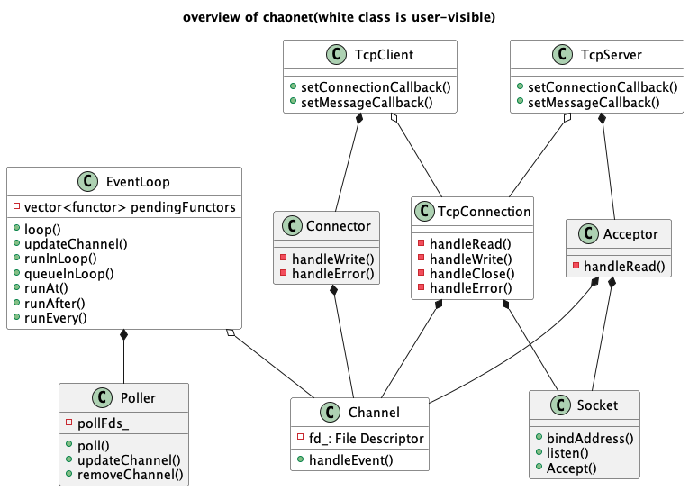
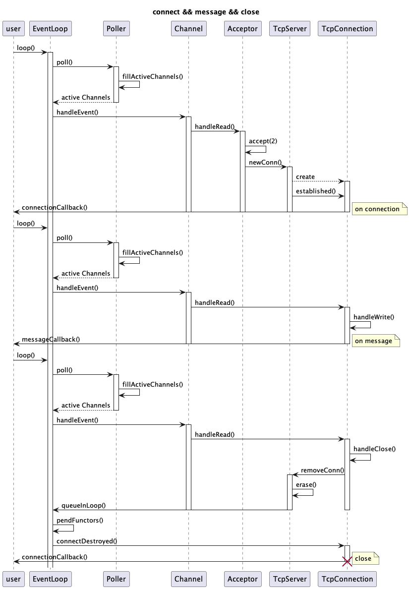
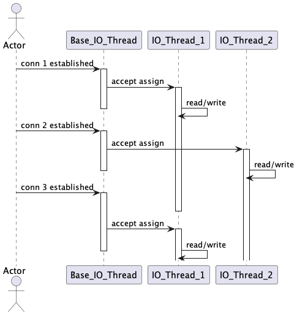

<!-- vim-markdown-toc GFM -->

* [引言](#引言)
* [总览](#总览)
* [原理介绍：创建连接、接受消息和关闭连接](#原理介绍创建连接接受消息和关闭连接)
* [多线程](#多线程)
* [使用示例](#使用示例)
* [总结](#总结)
* [外部链接](#外部链接)

<!-- vim-markdown-toc -->

### 引言

从去年开始接触Linux系统编程后，相继了解到许多网络编程方面的知识，我自己也尝试写过好几个网络应用，包括一个HTTP服务器[funWebServer]()，从最开始的阻塞模型、到accept + fork模型和accept + thread模型、再到select/poll/epoll IO 多路复用模型，最后到epoll + 线程池Reactor模型，改写了好几个版本，当时自觉对网络编程已然小有所成。如今看来，真是学得浅显，处处都是需要思考和学习的地方，方知当时思考过于马虎和粗浅。

chaonet 是今年以来根据自己去年学的Linux系统编程知识和网络编程相关书籍所写的一个C++静态库。虽然自知依然不够完善，编程库仅可作为个人学习参考，但我认为现在是时候对其进行总结回顾。接下来我将对chaonet的总体情况和关键代码进行介绍，此文过后，我希望chaonet这一项目能够告一断落，后面的工作应该多是完善文档或者进一步扩充示例代码。

### 总览

chaonet 包含20多个头文件和20多个源文件。其中最重要的部分如上图所示（白色是用户可见的，用户在使用时可能需要包含相应的头文件），包括：
 - EventLoop. chaonet采用非阻塞模型，IO事件驱动，所有服务均是在其相应的EventLoop中进行，程序只会在EventLoop的poller上，等待触发IO事件，待IO事件触发并处理完毕，继续轮询，除非显示调用`quit()`退出EventLoop;

- Channel. 一个Channel拥有一个文件描述符（在网络编程中最可能是一个socket 文件描述符），用于响应IO事件，调用相应的回调函数；

- TcpConnection. 即对应网络服务的一个Tcp连接，最为系统的有限资源，理所应当地利用RAII 进行连接管理，控制连接的生命周期。同时，作为网络库最重要的部分，用户通过设置TcpConnection类的读、写回调，控制连接的具体行为，例如接受消息、发送消息、关闭消息；

- TcpServer. 用户通过TcpServer和客户端建立TcpConnection，设置TcpConnection读写回调函数。一个TcpServer拥有若干个TcpConnection，每个连接在建立时被分配到相应的EventLoop中，各个连接互不相关，彼此独立。

- TcpClient. 同TcpServer，用它实现相应的客户端应用。

图中其他类作为chaonet内部关键类：

- Poller. 可以是poll(2)或者epoll(2)，用户IO多路复用，是非阻塞模型的关键组成。利用poll轮询可以注册并关注大量文件描述符的IO事件；

- Socket. 即对Linux网络编程接口的封装；

- Acceptor. 作为TcpServer接受新连接的工具类，内部实现即accept(2)；

- Connector. 作为TcpClient请求新连接的工具，内部实现即connect(2)；

事实上，还有EventLoopThread和EventLoopThreadPool两个关键类，我将在后面介绍。

### 原理介绍：创建连接、接受消息和关闭连接

chaonet 由事件驱动，这里的事件一般指网络IO事件。poller在EventLoop中监听网络IO事件，一旦有关注的事件发生就通知相应的Channel进行事件处理（通常是调用相应回调函数）。通过这一事件驱动模式来完成网络连接建立、收发网络消息和关闭网络连接等任务。

例如当Acceptor内部文件描述符可读时，`epoll_wait()`返回，被激活的acceptChannel调用读回调函数，在TcpServer中创建新连接，注册新连接的回调函数，例如onConnection、onMessage等回调函数。当TcpConnection 内部Channel被激活时，根据其内部socket 文件描述符可读可写情况，调用回调函数，接受消息、发送消息或关闭连接。示意图如上。

### 多线程

chaonet使用Reactor模型，这也是如今多数网络库、网络应用选择的模型，例如libevent、nginx、redis等等。上文已经简单介绍了chaonet IO多路复用方面的实现原理。本节主要介绍chaonet的多线程（线程池）相关内容。

chaonet的每个TcpServer都用一个EventLoopThreadPool对象，用户可以自己设置线程数量。当TcpServer创建新连接时，先从线程池拿出一个线程作为新连接的IO线程，新连接之后在此IO线程中进行事件响应。每个线程都对应唯一一个EventLoop，因此线程之间的连接时相互独立的，而又因为单个线程的所有连接都在一个EventLoop中，所以连接之间也是互不干扰。这样的one loop per thread策略极大程度避免了临界区的开销，不可谓不妙。一个简单的时序图如下：

### 使用示例

### 总结

chaonet是一个轻量化，基于Linux编程接口和Reactor模型编写的现代C++网络库。它虽然还有很多不足之处，但是用户已经可以轻易用来进行网络编程应用开发，我目前已经添加了许多网络应用，包括能够分快发送大文件的HTTP网络服务器、socks4a代理服务器、文件传输服务器等等。本网络库除了日志使用了[spdlog]()，其他均是基于C++17标准个人自主编写完成（许多思想和实现参考了陈硕的[muduo]()，受益非浅）。

### 外部链接

- [chaonet](https://github.com/literaryno4/chaonet)
- [muduo](https://github.com/chenshuo/muduo/)
- [spdlog](https://github.com/gabime/spdlog)
