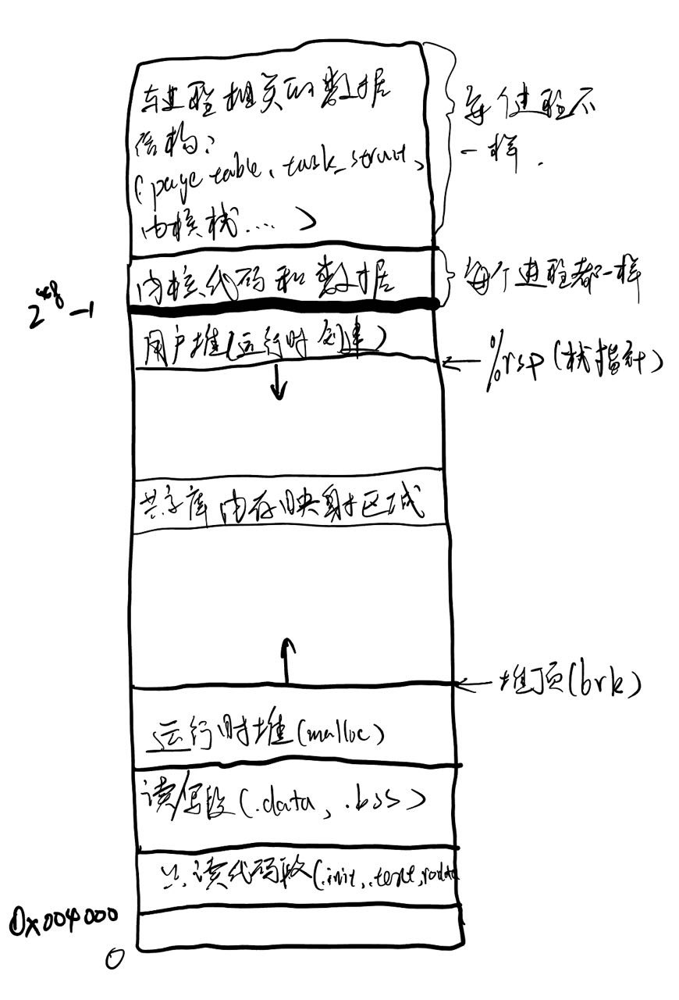
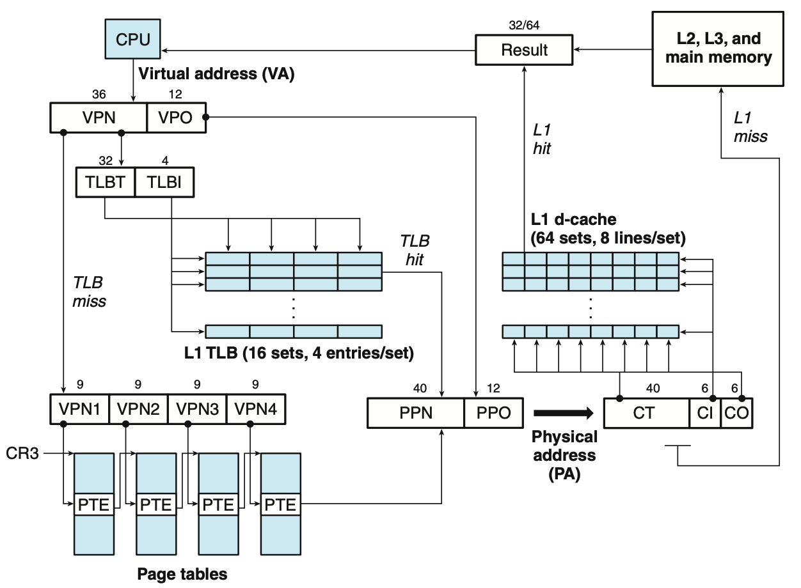
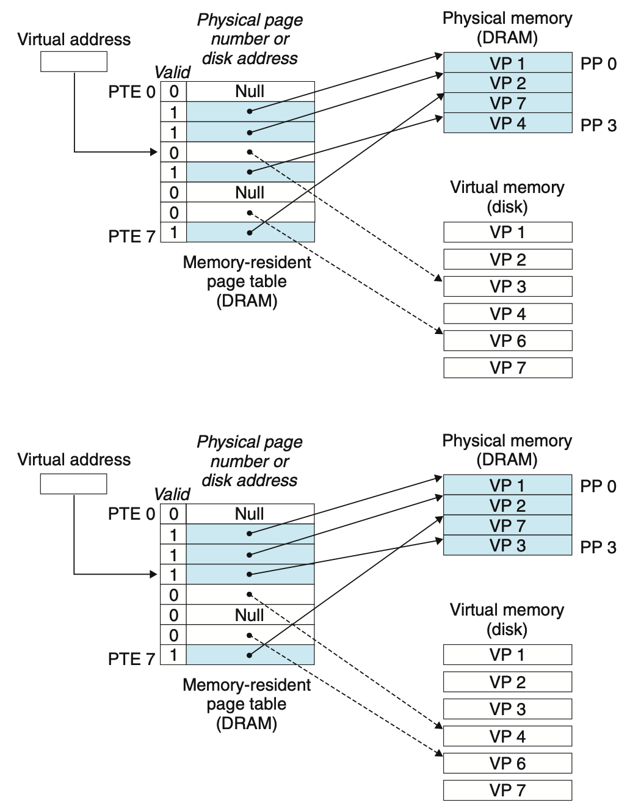

### 进程及其表现形式

**进程是一个可执行程序的实例**。这意味着进程从逻辑的角度来讲它是运行着的，将程序加载进入了内存，CPU随时能够运行它。

也就是说，一个程序加载入内存，就成为了进程。这里说的内存，不是单纯的物理内存，也可以是虚拟内存。在现代操作系统中，虚拟内存是最关键的概念之一，它：
- 作为物理内存的缓存。根据进程活动需要换入物理内存或被物理内存换出，提高了可使用内存空间；
- 简化内存管理。虚拟内存为每个进程都提供了统一的地址空间，每个进程的地址分布都独立统一，方便加载器、链接器对程序的处理；
- 安全。逻辑上独立的地址空间使得进程间不能随意影响。

#### 进程地址空间

在X86-64架构的Linux系统上，每一个进程的地址空间结构都如下图所示：

 

从上面可以看到，每个进程的地址空间都有用户区和内核区两个部分，用户区从虚拟地址`0x00400000`开始，$2^{48} - 1$结束，包括：

- 只读代码段。包括可执行文件（程序）的代码和只读数据；
- 读写段。也就是数据段，包括全局数据和静态数据，具体而言，初始化不为零的数据放在`.data`段，未初始化或初始化为零的全局、静态数据放在`.bss`段；
- 运行时堆。通常由malloc函数族进行分配，堆顶可由`brk(2)`、`sbrk(2)`系统调用改变；
- 内存映射段。进程可在该区域共享内存，一些共享库代码也在该区域；
- 用户栈。运行时用户创建的栈；

进程地址空间的内核区从$2^{48} - 1$开始，到$2^{64} - 1$结束，包括：

- 内核代码和数据。例如中断处理函数、默认信号处理程序等，该部分每个进程都一样；
- 与进程相关的数据结构。例如页表、task_struct、内核栈。

通过虚拟内存，我们使得每个进程都有统一的地址空间，简化内存管理。例如，对于链接器来说，不用关心程序实际在物理内存的地址，只需按照虚拟内存的地址分布进行链接即可。

#### 虚拟内存

有关虚拟内存的实现设计到软硬件结合，详细可以看[CSAPP]()。对于虚拟地址到物理地址的映射过程，如下图：



因此，CPU通过虚拟地址访问物理内存上的数据，主要包括如下几个步骤：
- 根据虚拟页号（VPN，地址前36位）映射物理页号（PPN）。如果在TLB缓存上直接映射即可，否则通过多级页表查表；
- 合并虚拟偏移量（VPO，后12位）。VPO直接映射为物理页偏移量PPO，与PPN合起来就是数据的物理地址；
- 尝试访问缓存。用拿到的物理地址访问缓存(CPU的多级缓存)，若数据在缓存上，直接把数据传给CPU；
- 访问物理内存。如果CPU缓存不命中，则进一步访问物理内存。

这里我主要想讲跟进程最想关的话题，也就是虚拟内存作为物理内存的缓存，与物理内存一起成为进程的表现形式。如最开始而言，程序进入内存就成为了进程。之后的进程就被存放在两个地方：物理内存（活动部分）、虚拟内存（未被缓存）。这两个部分的内容合起来就是进程地址空间所有段的集合。

自然会有人问，为何这么麻烦，要放在两个地方？

最简单的回答是，光放物理内存放不下，光放虚拟内存太慢。

我们的物理内存通常最多几十G，如果把所有进程都全放到物理内存，很快就会占满物理内存，而实际上大部分进程的内容是不常用的，完全没必要放到物理内存上。

虚拟内存的数据保存在磁盘上（比如Linux的swap分区），我们知道，磁盘和物理内存（DRAM）速度相差1000倍，如果进程常用部分也放在磁盘，会严重影响速度。

所以，为了进程运行效率，必须把用到的部分换入到物理内存，把不用的换出回虚拟内存。接下来就详细说一说进程如何在物理内存和虚拟内存之间进行交换。

#### 页命中

本质上，物理内存就是虚拟内存的缓存。和所有缓存一样，缓存的数据都是以块为单位，这里的块又叫做页。当CPU访问进程地址空间时，如果访问的数据被缓存到了物理内存的某个物理页上，就叫做页命中。

注意到在缓存结构中，物理内存与CPU L3缓存（SRAM）的速度只相差10倍，而磁盘与物理内存的速度相差1000倍，这意味着如果页不命中，CPU的访问速度会极大地下降，惩罚特别高。所以为了提升CPU的页命中率，页通常比较大，一般在4K～2M字节，Linux默认4K。

#### 缺页异常

当CPU访问访问没有被缓存到物理内存的进程内容时，就会发生页不命中，也就是缺页异常（又有说缺页中断的）。和其他缓存一样，发生缺页异常时，系统首先将缓存中最不常用（或其他算法）的物理页写回（write back）到虚拟内存，然后以页为单位把要访问的内容所在的整个虚拟页缓存到物理内存中。如下图所示：



可以看到，缺页异常的过程大致分如下几步：

- 找到虚拟页。系统根据虚拟地址和CR3寄存器，经过多级页表找到数据所在页的页表条目PTE3，发现（缓存）有效位为0，说明该页不在物理内存，于是发生缺页异常，找到对应的虚拟页VP3；
- 写回牺牲页。根据缓存替换算法（一般是LRU）找到一个牺牲页VP4（在PP3处），将其写回至虚拟内存（磁盘）；
- 复制虚拟页到物理内存。将VP3复制到物理内存PP3处，将缓存有效为置为1；
- 重新执行导致缺页异常的指令。这回，目标页在物理内存上，能够拿到在物理内存上的数据，不会发生缺页异常了。

#### 简化程序加载

通过上面页的按需调度机制。可以极大地简化程序加载为进程的过程。当加载程序为一个进程时，我们根本不需要把程序复制到物理内存中，加载器只需为代码段和数据段分配虚拟页，修改新进程的页表，将页表指向程序（目标文件）的相应位置即可。等到CPU调度到新进程时，按需换入虚拟页到物理内存即可。

#### 进程表现为以页为单位的逻辑组合

通过上面的介绍。我们应该知道，一个进程在计算机上的表现形式就是系统为该进程缓存或分配的物理页和虚拟页的集合，物理页被缓存在物理内存上，如果长久不使用，可能会被换出到虚拟内存；虚拟页被分配在虚拟内存（磁盘）上，当被访问时，会先被换入到物理内存进行缓存。

### 进程的创建

#### 通过fork系统调用创建新进程

在Linux中，除了0号进程，其他进程都是通过`fork(2)`（或者类似的如`vfork(20)`，`clone(2)`）[系统调用]()创建新的进程。在前面介绍系统调用的时候，我们也看到过`fork`系统调用的源码：

```assembly
_sys_fork:
    call _find_empty_process
    testl %eax,%eax
    js 1f
    push %gs
    pushl %esi
    pushl %edi
    pushl %ebp
    pushl %eax
    call _copy_process
    addl $20,%esp
1:  ret
```

可以看到，系统创建新进程时主要分两步：

- 找到一个空的进程；
- 将父进程拷贝到新进程。

先看第一步`find_empty_process`的代码:
```assembly
long last_pid = 0;

int find_empty_process(void) {
    int i;
    repeat:
        if ((++last_pid)<0) last_pid=1;
        for(i=0 ; i<64 ; i++)
            if (task[i] && task[i]->pid == last_pid) goto repeat;
    for(i=1 ; i<64; i++)
        if (!task[i])
            return i;
    return -EAGAIN;
}
```
可以看到，这一步的目的是为新进程找到一个`pid`，然后返回第一个没被占用的空task。这里的task[]数组是操作系统初始化时分配的。

之后，通过`copy_process`复制父进程的`task_struct`到上述空task里，关键代码如下：
```c 
int copy_process(int nr,long ebp,long edi,long esi,long gs,long none,
        long ebx,long ecx,long edx,
        long fs,long es,long ds,
        long eip,long cs,long eflags,long esp,long ss)
{
    struct task_struct *p;
    int i;
    struct file *f;


    p = (struct task_struct *) get_free_page();
    if (!p)
        return -EAGAIN;
    task[nr] = p;
    *p = *current;  /* NOTE! this doesn't copy the supervisor stack */
    p->state = TASK_UNINTERRUPTIBLE;
    p->pid = last_pid;
    p->father = current->pid;
    p->counter = p->priority;
    p->signal = 0;
    p->alarm = 0;
    p->leader = 0;      /* process leadership doesn't inherit */
    p->utime = p->stime = 0;
    p->cutime = p->cstime = 0;
    p->start_time = jiffies;
    p->tss.back_link = 0;
    p->tss.esp0 = PAGE_SIZE + (long) p;
    p->tss.ss0 = 0x10;
    p->tss.eip = eip;
    p->tss.eflags = eflags;
    p->tss.eax = 0;
    p->tss.ecx = ecx;
    p->tss.edx = edx;
    p->tss.ebx = ebx;
    p->tss.esp = esp;
    p->tss.ebp = ebp;
    p->tss.esi = esi;
    p->tss.edi = edi;
    p->tss.es = es & 0xffff;
    p->tss.cs = cs & 0xffff;
    p->tss.ss = ss & 0xffff;
    p->tss.ds = ds & 0xffff;
    p->tss.fs = fs & 0xffff;
    p->tss.gs = gs & 0xffff;
    p->tss.ldt = _LDT(nr);
    p->tss.trace_bitmap = 0x80000000;
    if (last_task_used_math == current)
        __asm__("clts ; fnsave %0"::"m" (p->tss.i387));
    if (copy_mem(nr,p)) {
        task[nr] = NULL;
        free_page((long) p);
        return -EAGAIN;
    }
    for (i=0; i<NR_OPEN;i++)
        if (f=p->filp[i])
            f->f_count++;
    if (current->pwd)
        current->pwd->i_count++;
    if (current->root)
        current->root->i_count++;
    if (current->executable)
        current->executable->i_count++;
    set_tss_desc(gdt+(nr<<1)+FIRST_TSS_ENTRY,&(p->tss));
    set_ldt_desc(gdt+(nr<<1)+FIRST_LDT_ENTRY,&(p->ldt));
    p->state = TASK_RUNNING;    /* do this last, just in case */
    return last_pid;
}
```

在函数中，首先请求分配上一节所述的虚拟页，用于存放新进程的数据，然后拷贝父进程`current`的task_struct到虚拟页中。并不是新进程的所有`task_struct`都和父进程一样，所以紧接着进行修改，包括pid、计数器、优先级、tss上下文等。然后通过`copy_mem`拷贝父进程的页表信息，由于这里的代码是Linux-0.11不支持虚拟内存，所以比较麻烦。如果支持虚拟内存，这里直接拷贝父进程页表即可，因为我们不用担心虚拟地址与父进程一样。在新版本Linux实现中，自然添加了许多新的数据结构，但是思路都是这样，这里为了简单就不列举源码了。但应该知道，新版本`task_struct`里添加了`mm_struct`，系统通过它来区分虚拟内存中有效的段。`mm_struct` 结构如下图：

#### 写时拷贝

我们发现，在创建新线程的时候，一个进程最关键的代码段和数据段似乎完全没有被拷贝。也就是说，创建新进程后，父进程和子进程共享同一部分物理内存（包括代码段、数据段、共享库）。是的，系统在创建新进程时完全没必要为其单独分配内存。等到进程真正修改共享的部分时，再分配内存将这修改部分拷贝过去。

具体的在创建进程复制页表的时候，把能够共享的部分的页表设置为只读，这样父进程和新进程都能同时读这段内存，提升进程创建效率，当等到该内存在父进程或新进程有一个被写的时候，再将这部分内存拷贝到新的地方。

上述过程就叫做**写时拷贝**，过程如下图所示：

### 进程的调度

#### 时间片和优先级

#### 异常

### 其他话题 

#### 进程间通信

从新进程的创建过程我们可以看到，进程与进程之间是相互独立了，这为内存管理带来了许多方便，也让进程变得更加安全。但是，进程之间彼此独立不方便我们进行通信。因此操作系统需要额外提供一些进程之间通信（IPC）的方式。有关IPC的话题可以扩展讲很多，这里仅简单列举：

- 管道。分无名管道和有名管道，父子进程可以使用无名管道进行通信。有名管道又叫FIFO，可用于任意进程间通信；

- 消息队列。允许进程间以消息的形式交换数据。与管道的最大区别是它是面向消息的；

- 共享内存（内存映射）。在用户区堆和栈之间的内存映射区共享数据，各进程之间共享这一块内；

- 信号量。通过P、V操作进行进程间同步，比如共享内存的同步；

- 信号。也可以用作简单的通信；

- Socket。常用作不同主机间的进程间通信，比如网络编程；

- 环境变量。这是最简单最常用的进程间通信方式，但常被人忽略。


### 参考文献

- [操作系统源码](https://mp.weixin.qq.com/mp/appmsgalbum?__biz=Mzk0MjE3NDE0Ng==&action=getalbum&album_id=2123743679373688834&scene=173&from_msgid=2247501700&from_itemidx=1&count=3&nolastread=1#wechat_redirect)

- [Linux/UNIX系统编程手册](https://book.douban.com/subject/25809330/)
