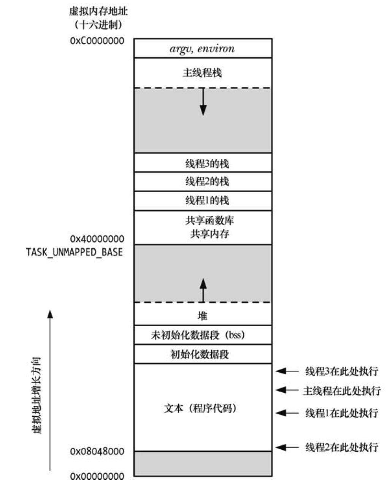

### 线程的由来

我们在[进程的方方面面]()中详细介绍的进程是如何存在于系统中，如何被创建的，丝毫没有题线程。这是因为最开始Linux下是没有线程的，后来，由于弥补进程的缺点，才实现了线程。是的，进程并不完美，他最大的缺点就是慢：

- 创建慢。即便有写时拷贝，我们不需要在创建时复制用户区代码和数据，但仍需要复制task_struct、复制页表、文件描述符等大量进程信息；

- 上下文切换慢。进程上下文切换会先保存寄存器信息、程序计数器、进程状态等大量全局信息。

- 进程间沟通不方便。需要IPC，而线程可以直接通过全局变量进行通信。

引入线程本质上就是想通过避免复制许多全局信息来加速一个新进程的创建和上下文切换。

### Linux下使用`clone(2)`实现线程

相比于进程，新线程在创建的时候与父线程共享全局信息，自己仅拥有独立的用户栈（保存局部变量）和少量线程信息（如tid）。我们的线程在一个进程中的地址分布大致应该是这样（4个线程）：



因此想要实现一个线程应该不会比创建一个进程难。我们只需要把创建进程的代码拿过来，然后去掉大量复制全局信息的代码（如复制虚拟内存信息、复制文件描述符表等全局进程信息），接着增加创建线程虚拟页的代码，在一个线程地址空间中，我们可以创建独立的用户栈。

在Linux下提供`clone(2)`系统调用，它的关键实现代码在`fork.c`中，也就是说它和`fork`类似，都是用来创建进程的，但区别是它可以更加细致地通过`clone_flag`参数控制创建进程时要复制的内容。通过一系列Linux提供的`clone_flag`组合，我们就可以轻松实现线程了。具体地：

```c 
#define _GNU_SOURCE
#include <sched.h>

int clone(int (*fn)(void *), void *child_stack,
         int flags, void *arg, ...
         /* pid_t *ptid, void *newtls, pid_t *ctid */ );
```

使用如下`clone_flag`创建Linux线程：

```c：
CLONE_VM ｜CLONE_FILES｜CLONE_FS｜CLONE_SIGHAND
```

- CLONE_VM 表示父子进程共享同一份虚拟内存页；

- CLONE_FILES 表示父子进程共享共一个打开文件描述符表；

- CLONE_FS 表示父子进程共享与文件系统相关的信息，例如权限、目录；

- CLONE_SIGHAND 表示父子进程共享同一个信号处理函数表。

这样利用`clone`避免创建进程时要复制的信息，可以方便地就实现了一种创建线程的方式。一般而言创建线程比创建进程快10多倍。

### 参考文献

- [Linux/UNIX系统编程手册](https://book.douban.com/subject/25809330/)
