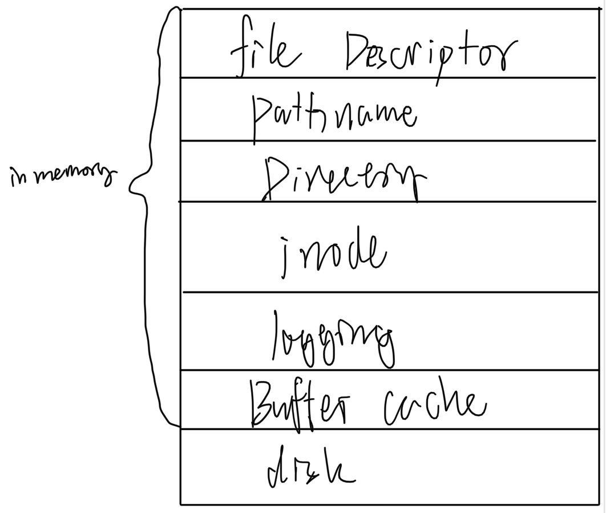
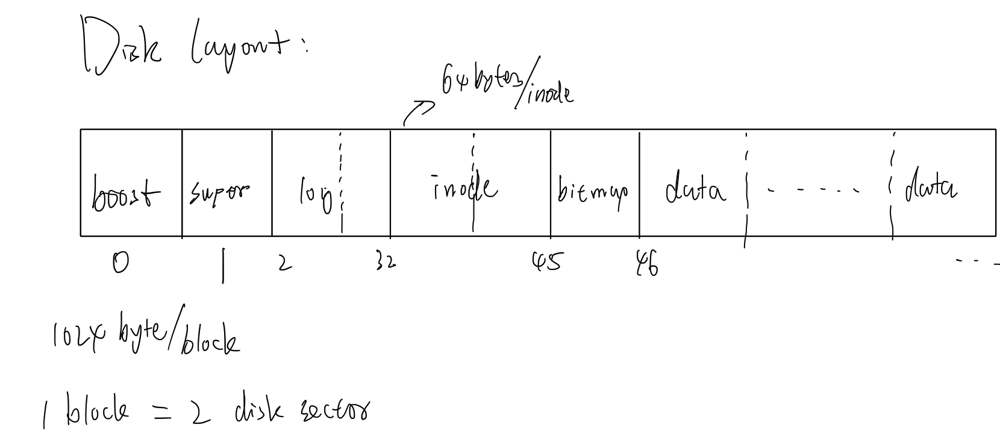
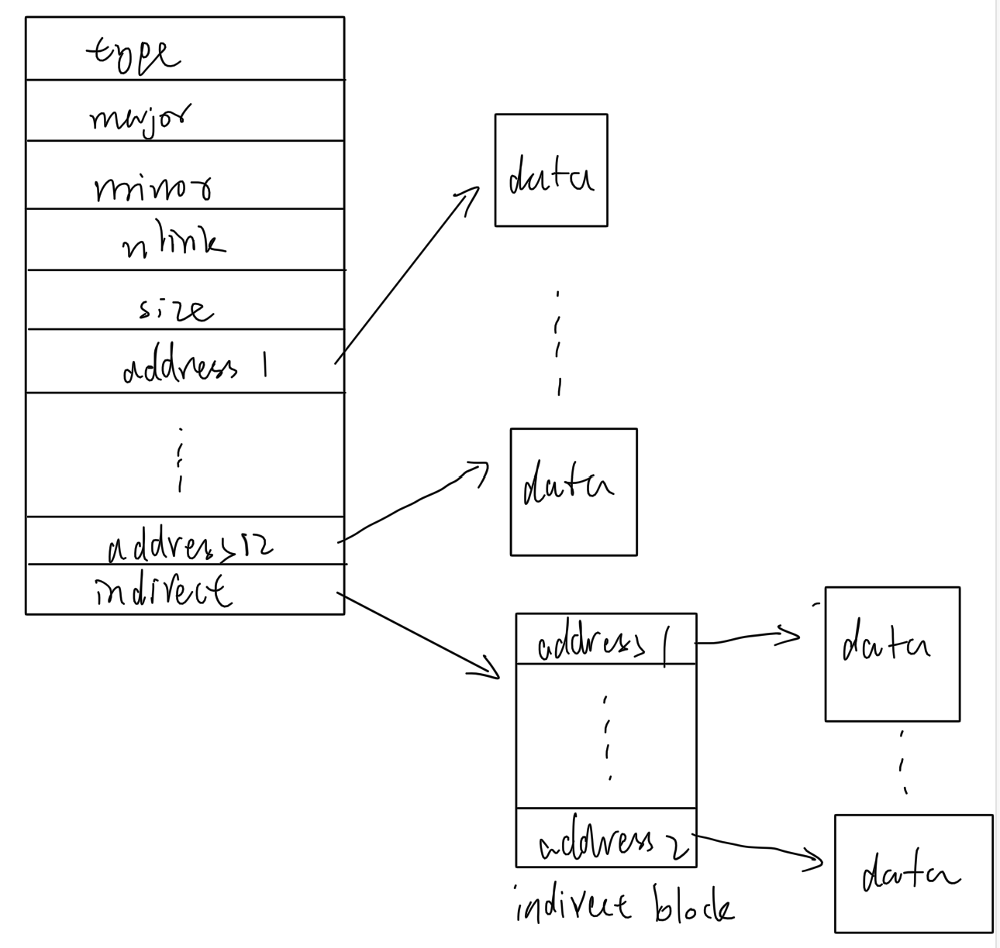
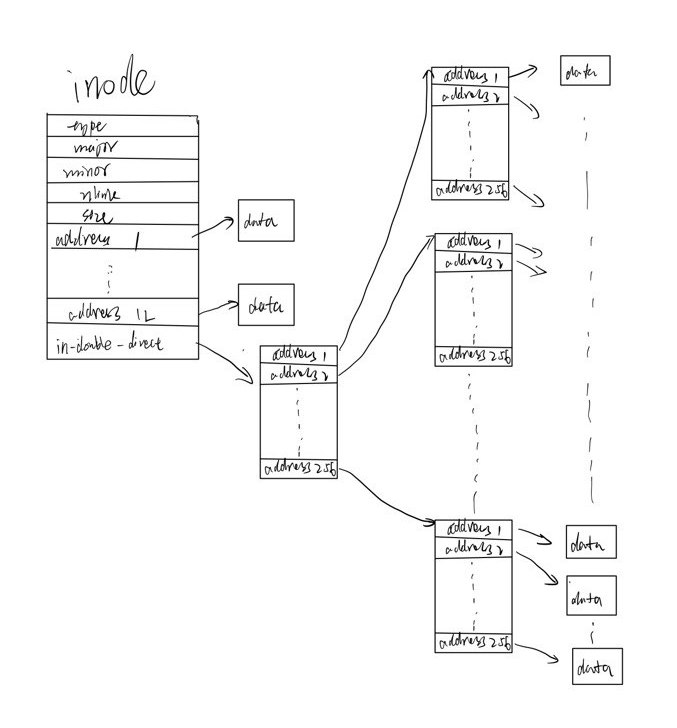
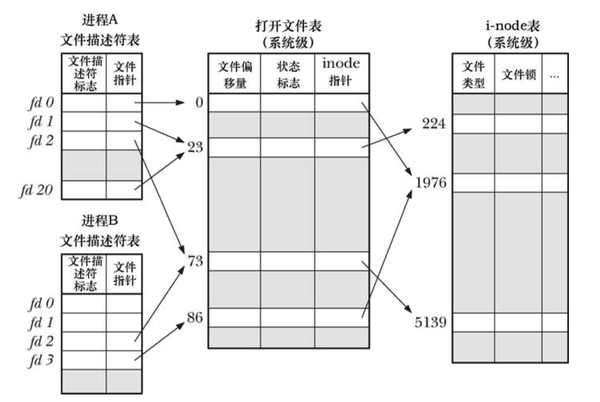

<!-- vim-markdown-toc GFM -->

* [引言](#引言)
* [文件系统抽象层级](#文件系统抽象层级)
* [一个文件在磁盘中是如何被记录的](#一个文件在磁盘中是如何被记录的)
    * [XV6 的磁盘布局](#xv6-的磁盘布局)
    * [一个典型的文件是如何存放在磁盘的](#一个典型的文件是如何存放在磁盘的)
* [Buffer cache](#buffer-cache)
* [logging](#logging)
* [inode](#inode)
* [目录、路径名和文件描述符](#目录路径名和文件描述符)
    * [目录](#目录)
    * [路径名](#路径名)
    * [文件描述符](#文件描述符)
* [并发与同步](#并发与同步)
* [总结](#总结)
* [参考文献](#参考文献)

<!-- vim-markdown-toc -->

### 引言

在一个本地计算机结构中，磁盘在最底层的位置，这意味着它的响应速度最慢，物理空间最大，一般被用作永久存储数据。磁盘比它的上层存储结构（物理内存）的响应速度慢了2-3个数量级。因此，必须做类似于物理内存与CPU之间的缓存工作。同时，为了保证磁盘数据的安全性，也应该具有崩溃恢复的机制。此外，为了易于使用和提供并发，应该给用户提供一个文件抽象而不是让用户之间操作磁盘文件。上述关于磁盘文件的种种机制最为一个整体，被叫做文件系统。

### 文件系统抽象层级

XV6操作系统的文件系统逻辑层级如下：



自底向上分别是：
- 物理磁盘；
- 磁盘缓冲区。缓存常用的磁盘块，可以避免直接访问磁盘速度太慢的问题；
- 日志。用于崩溃恢复，保证磁盘数据安全，每次对磁盘的写入之前都会先在日志区进行记录；
- inode。索引节点，每个索引节点对应于磁盘的一个物理文件；
- 目录。特殊的文件，内容为当前目录下的文件条目；
- 文件名。被目录所记录，用户一般直接使用它来查找对应文件inode从而操作文件；
- 文件描述符。每个进程都维护着其打开的文件，用文件描述符代表，其内部包含这个打开文件的若干信息，用户只需关注文件描述符本身。

下面对上述分层分别进行介绍。

### 一个文件在磁盘中是如何被记录的

#### XV6 的磁盘布局

先看看XV6文件系统的磁盘布局，注意XV6以1024bytes为一个块（block）作为文件系统操作的基本单位（一般代表2个磁盘扇区），从左到右依次为：


- boot区。一个块，存启动相关代码；
- super区。磁盘分区的相关分布信息，例如log区占多少个块，起始位置等等；
- log区。存日志相关信息，用于崩溃恢复；
- inode区。索引节点，一个索引节点代表一个文件，用索引节点才能找到其对应文件存放的块的地址；
- bitmap区。该位图用来表示数据块是否有效，即是否是一个文件的一部分。

#### 一个典型的文件是如何存放在磁盘的

如上所述，一个inode对应一个文件。那么它是如何对应一个文件呢？也就是说，我们如何根据一个inode唯一确定一个存放在磁盘的文件呢？先看看inode代码表示：
```c 
// On-disk inode structure
struct dinode {
  short type;           // File type
  short major;          // Major device number (T_DEVICE only)
  short minor;          // Minor device number (T_DEVICE only)
  short nlink;          // Number of links to inode in file system
  uint size;            // Size of file (bytes)
  uint addrs[NDIRECT+1];   // Data block addresses
};
```
将其画出来：


可以看到，inode可以根据12个地址在加上`indirect` 指向的256个地址确定文件包含的所有数据块。即每个地址都能找到一个块编号（blocknumber），按顺序找到所有有效块就能表示唯一的一个文件。

显然，这里一个文件最大可以为$(12+256) \times 1024$bytes。进一步扩大文件，可以再添加`indirect`或者将`indirect`改为 `double indirect`，思想类似于页表。例如，我们把`indirect`修改为`double indirect`，如下图所示：



通过两级间接索引，最大文件可以为$(12+256 * 256) \times 1024$bytes。

### Buffer cache

操作磁盘速度非常慢，毫秒级。因此需要通过类似CPU缓存的机制加速对磁盘的访问。也就是说，将常用的磁盘block缓存到物理内存中，将不用的进行替换，这其中最常用的替换策略就是LRU。

### logging

为了保证数据安全，做到崩溃恢复，日志（写日志）是必须的。具体的场景如下，例如我们直接写一个磁盘上的inode，表示它已经被使用，在还没有真正写数据的时候断电了。当重启之后这个inode表示被使用了，但实际上它不代表任何文件。这会导致不可挽回的问题，因为我们没法删除操作这个inode。

因此我们需要一种机制，保证对磁盘的文件操作具有原子性，也就是说，对一个磁盘文件来说，要没操作已经完成，要么还没开始，不会出现断电之后重启完成后发现之前的操作只完成了一半，没办法恢复到操作之前或者继续完成操作。

这里的主要思想是借助日志进行恢复，我们遵守**write ahead rule**，将一个文件操作叫做一个事务（transaction），类似于数据库。在我们每次对磁盘的操作前，我们先对要做的操作进行记录，存放在日志区，在日志区存放好之后，我们进行commit，这是才实际对磁盘文件进行操作。整个过程中，不管何时断电，我们都可以将文件恢复到操作之前的状态或者之后的状态。从而确保数据的安全一致性。

比如在commit之前断电，重启之后不需要做任何事情，因为我们还没有对文件实际做任何事情。如果是在commit之后断电，重启之后系统会检查log的内容，发现上次文件操作没有完成，于是重新根据log的记录操作一遍文件，因为操作是幂等的（例如写操作），所以我们能正确保证到达操作完成之后的状态。

### inode

磁盘中保存有inode，那为什么还要把inode分层到这么上层呢。因为上述的分层思想只是逻辑上的，其主要想表达的意思是，用户对于文件的操作，比如对文件描述符的读写，其实际上都会在系统调用处理函数中落到对inode的读和写，通过inode，系统找到实际的文件数据（在buffer cache中或者磁盘上）进行读和写而不是直接根据文件名字或者文件描述符就能找到文件数据进行读和写。

### 目录、路径名和文件描述符

#### 目录

目录是一个特殊的文件，其内容是一个个目录条目（dirent），每个条目就是该目录下的一个文件或目录，代码表示如下：
```c
struct dirent {
  ushort inum;
  char name[DIRSIZ];
};
```

两项内容分别是inode号和文件或目录名，inode号是表示该目录条目对应的inode，名字就是用户看到的文件或名录名字。通常，我们想操作一个文件的时候都是直接传入文件或名录名（路径名）到文件相关系统调用中。

#### 路径名

文件相关系统调用（open、link等）的参数都会传入文件名（或者路径名），如果是路径名，系统会从根目录开始进行解析查找到目标文件。

#### 文件描述符

我们打开一个文件后会得到一个文件描述符，用户对文件的操作一般都是通过把文件描述符传入相应的读写系统调用中进行的。每个进程都会维护一个文件描述符列表，它不和其他进程冲突，这样用户进程就好像能够独立地不受外界影响地读写文件。但实际上，每个进程是根据文件描述符索引到一个打开文件表项指针，通过该指针找到系统全局的打开文件表，从而找到inode指针进行读写。

我们看一看XV6的进程结构体：
```c 
// Per-process state
struct proc {
  // ... 

  struct file *ofile[NOFILE];  // Open files

  // ...
};
```
我们一般都是通过文件描述符索引到相应的文件指针：`struct file* f = myproc()->ofile[fd]`，一个file结构体定义如下：
```c 
struct file {
  enum { FD_NONE, FD_PIPE, FD_INODE, FD_DEVICE } type;
  int ref; // reference count
  char readable;
  char writable;
  struct pipe *pipe; // FD_PIPE
  struct inode *ip;  // FD_INODE and FD_DEVICE
  uint off;          // FD_INODE
  short major;       // FD_DEVICE
};
```

包含了文件类型、引用计数、读写权限、inode指针、偏移量等信息，所以我们打开文件的信息都是系统通过维护这样一个结构体来做到的，用户只需要简单的使用文件描述符，系统会帮我们维护引用计数、偏移量等信息。

为了更好的理解，进程与进程间文件描述符与全局系统打开文件表、inode之间的关系，请看下图：



可以发现：
- 在进程A中，文件描述符1和20指向同一个打开文件表项，这可能是调用`dup(2)`形成的；
- 进程A的文件描述符2和进程B的文件描述符2都指向同一个打开文件表项，这可能是在调用`fork(2)`后形成的，父子进程共享一个文件信息（偏移量、状态、inode），也就是说它们之间对文件的修改是相互可见的；
- 进程A的文件描述符和进程B的描述符3分别指向不同的打开文件表项，但是最终两者的inode指针都指向同一个inode，这说明两个进程分别`open(2)`了同一个文件，因为是分别打开的，所以偏移量、状态标志都可以独立不一样。这也印证了只有inode才是和文件一一对应，文件描述符不是的结论。

### 并发与同步

在上一节中，我们知道，两个进程可以同时打开同一个文件，这意味着可以并发得操作inode，如果不加以限制，很可能破坏不变性，例如inode可能有效但不指向文件。所以在操作inode的时候（读写文件、修改已打开引用计数等），我们会使用锁来确保不变性，所以在内存中的inode会比磁盘中的inode多出几项，定义如下：
```c 
// in-memory copy of an inode
struct inode {
  uint dev;           // Device number
  uint inum;          // Inode number
  int ref;            // Reference count
  struct sleeplock lock; // protects everything below here
  int valid;          // inode has been read from disk?

  short type;         // copy of disk inode
  short major;
  short minor;
  short nlink;
  uint size;
  uint addrs[NDIRECT+1];
};
```

其中就包括一个睡眠锁，使用睡眠锁而不是普通锁的原因是，操作inode可能涉及到操作磁盘，时间特别长，在获取锁的时候我们不必空等，而可以主动睡眠将cpu调度给其他进程。

### 总结

总的来说，操作系统与文件打交道利用了两层抽象，一个是inode，通过它系统自己可以间接的操作磁盘，用缓存和日志兼顾效率和安全；另一个是文件描述符，通过它可以隔离inode，用户可以方便的打开、读写文件，避免直接操作inode而关注过多文件的细节。

### 参考文献

- [MIT6.S081](https://mit-public-courses-cn-translatio.gitbook.io/mit6-s081/lec14-file-systems-frans)

- [Linux/UNIX系统编程手册](https://book.douban.com/subject/25809330/)
