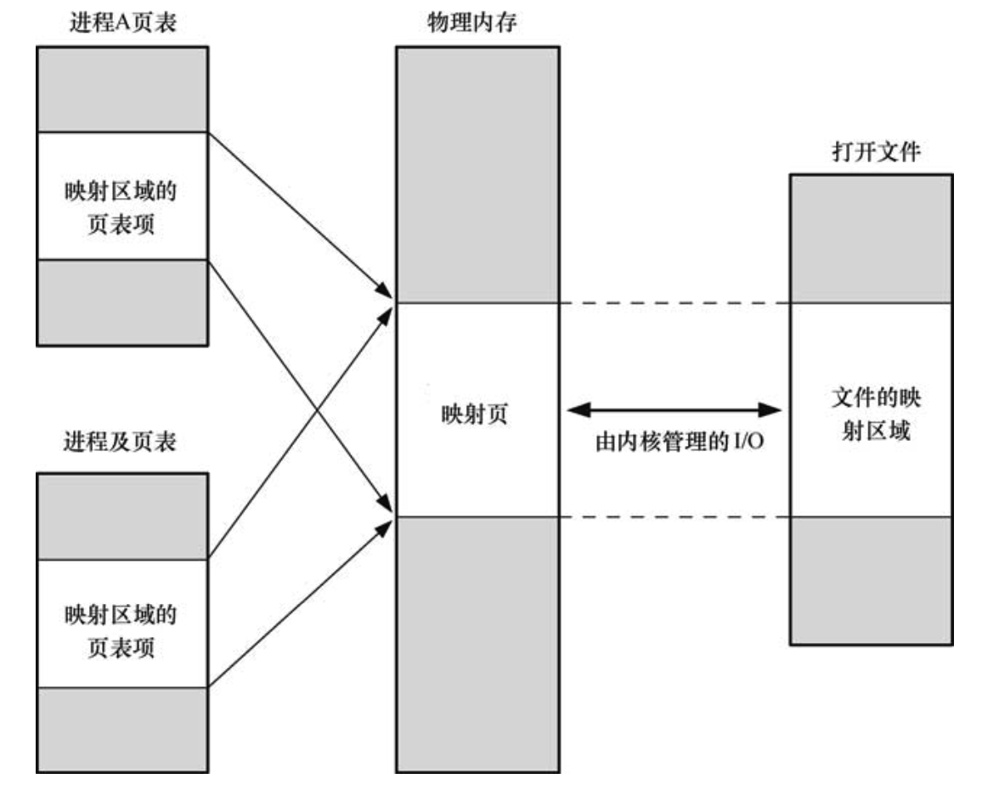

### 共享内存

通过共享内存，能够实现进程间通信，它的好处是不用像管道那样需要往内核缓冲区读写数据，更加快速，缺点是需要一个同步机制保证多进程对共享内存访问的一致性。Linux下提供共享内存的接口如下：

```c 
#include <sys/shm.h>

int
shmget(key_t key, size_t size, int shmflg);
```

- key 用来关联共享内存，进程通过它来定位同一段共享内存；
- size 是共享内存分配大小，实际上是页的整数倍；
- shmflag 指定获取方式（是否已经创建）和共享内存的权限。

下面给出一个简单的使用例子，只有一个写者和一个读者，所以忽略进程间同步：
```c 
// writer.c
#include <stdlib.h>
#include <stdio.h>
#include <sys/stat.h>
#include <sys/types.h>
#include <sys/shm.h>
#include <string.h>
#include <unistd.h>

#define SHM_KEY 0x1234

int main(int argc, char** argv) {
    int shmid;
    char* shmp;
    char* message = "shared memory here!\n";
    shmid = shmget(SHM_KEY, 1024, IPC_CREAT | S_IRUSR | S_IWUSR);
    if (shmid == -1) {
        perror("shmget error!");
        exit(1);
    }
    shmp = shmat(shmid, NULL, 0);
    if (shmp == (void*) - 1) {
        perror("shmat error!");
        exit(-1);
    }
    strncpy(shmp, message, strlen(message));
    sleep(30);
}
```
```c 
// reader.c
#include <stdlib.h>
#include <stdio.h>
#include <sys/stat.h>
#include <sys/types.h>
#include <sys/shm.h>
#include <string.h>
#include <unistd.h>

#define SHM_KEY 0x1234

int main(int argc, char** argv) {
    int shmid;
    char* shmp;
    char buffer[1024];
    shmid = shmget(SHM_KEY, 0, 0);
    if (shmid == -1) {
        perror("shmget error!");
        exit(1);
    }
    shmp = (char*)shmat(shmid, NULL, SHM_RDONLY);
    if (shmp == (char*) - 1) {
        perror("shmat error!");
        exit(-1);
    }
    strncpy(buffer, shmp, 20);
    buffer[20] = '\0';
    printf("%s\n", buffer);
}
```
写者分配并attach一段共享内存，读者读取这一段共享内存并打印。可以通过`proc(5)`查看到分配的共享内存：
```shell 
$ cat /proc/PID/maps
```
我的Linux机器上看到的内容如下：
```
556ca2add000-556ca2ade000 r-xp 00000000 08:11 237830147                  /data/chao/shmandmmap/writer
556ca2cdd000-556ca2cde000 r--p 00000000 08:11 237830147                  /data/chao/shmandmmap/writer
556ca2cde000-556ca2cdf000 rw-p 00001000 08:11 237830147                  /data/chao/shmandmmap/writer
7f23d0911000-7f23d0af8000 r-xp 00000000 08:03 23731778                   /lib/x86_64-linux-gnu/libc-2.27.so
7f23d0af8000-7f23d0cf8000 ---p 001e7000 08:03 23731778                   /lib/x86_64-linux-gnu/libc-2.27.so
7f23d0cf8000-7f23d0cfc000 r--p 001e7000 08:03 23731778                   /lib/x86_64-linux-gnu/libc-2.27.so
7f23d0cfc000-7f23d0cfe000 rw-p 001eb000 08:03 23731778                   /lib/x86_64-linux-gnu/libc-2.27.so
7f23d0cfe000-7f23d0d02000 rw-p 00000000 00:00 0
7f23d0d02000-7f23d0d2b000 r-xp 00000000 08:03 23731763                   /lib/x86_64-linux-gnu/ld-2.27.so
7f23d0f28000-7f23d0f29000 rw-s 00000000 00:01 4                          /SYSV00001235 (deleted)             // shared memory
7f23d0f29000-7f23d0f2b000 rw-p 00000000 00:00 0
7f23d0f2b000-7f23d0f2c000 r--p 00029000 08:03 23731763                   /lib/x86_64-linux-gnu/ld-2.27.so
7f23d0f2c000-7f23d0f2d000 rw-p 0002a000 08:03 23731763                   /lib/x86_64-linux-gnu/ld-2.27.so
7f23d0f2d000-7f23d0f2e000 rw-p 00000000 00:00 0
7ffc71de5000-7ffc71e06000 rw-p 00000000 00:00 0                          [stack]
7ffc71ead000-7ffc71eb0000 r--p 00000000 00:00 0                          [vvar]
7ffc71eb0000-7ffc71eb1000 r-xp 00000000 00:00 0                          [vdso]
ffffffffff600000-ffffffffff601000 --xp 00000000 00:00 0                  [vsyscall]
```
可以看到，写者进程确实含有一段内存（中间被注释的一行），它的位置在堆和栈之间，很合理。

### 内存映射

内存映射分为文件映射和匿名映射。本质上就是把一个文件（或虚拟文件）映射到内存中，达到**初始化一段内存**（私有映射，不会修改实际文件）或者**进程间共享这段内存**（共享映射，会实际修改对应文件）。

一个典型的共享映射示意图如下：



Linux的接口声明如下：
```c 
#include <sys/mman.h>

void *
mmap(void *addr, size_t len, int prot, int flags, int fd, off_t offset);
```

- addr用来指定映射到内存哪儿，如果是NULL就交给内核指定；
- len 是映射文件的实际大小；
- prot 是映射到内存区域的权限；
- flags 用来指定私有映射还是共享映射；
- fd 是映射文件的文件描述符；
- offset 是文件偏移量

下面写一个简单的共享映射的例子，其他情况也类似：

```c 

//
// shell: 
// echo 'memory map me' > mmap.txt
//

#include <stdlib.h>
#include <stdio.h>
#include <sys/stat.h>
#include <sys/types.h>
#include <sys/mman.h>
#include <string.h>
#include <unistd.h>
#include <fcntl.h>

int main(int argc, char** argv) {
    int fd;
    char* addr;
    char buffer[1024] = {'\0'};
    char buffer2[1024] = {'\0'};
    char* messege = "txt changed!\n";
    struct stat sb;
    fd = open("mmap.txt", O_RDWR);
    if (fd == -1) {
        perror("shmget error!");
        exit(1);
    }

    if (fstat(fd, &sb) == -1) {
        perror("shmget error!");
        exit(1);
    }
    addr = mmap(NULL, sb.st_size, PROT_READ | PROT_WRITE, MAP_SHARED, fd, 0);
    if (addr == MAP_FAILED) {
        perror("mmap error!");
        exit(1);
    }
    strncpy(buffer, addr, sb.st_size);
    printf("read from mem: %s", buffer);

    // change memory mapped
    strncpy(addr, messege, strlen(messege));
    read(fd, buffer2, strlen(messege));
    printf("read from mem: %s", buffer2);
}
```
运行结果如下：
```
read from mem: memory map me
read from mem: txt changed!
```

进程的内存分布如下：
```
5613be2ab000-5613be2ac000 r-xp 00000000 08:11 237830152                  /data/chao/shmandmmap/mmap
5613be4ac000-5613be4ad000 r--p 00001000 08:11 237830152                  /data/chao/shmandmmap/mmap
5613be4ad000-5613be4ae000 rw-p 00002000 08:11 237830152                  /data/chao/shmandmmap/mmap
5613bf54c000-5613bf56d000 rw-p 00000000 00:00 0                          [heap]
7f9fe30e8000-7f9fe32cf000 r-xp 00000000 08:03 23731778                   /lib/x86_64-linux-gnu/libc-2.27.so
7f9fe32cf000-7f9fe34cf000 ---p 001e7000 08:03 23731778                   /lib/x86_64-linux-gnu/libc-2.27.so
7f9fe34cf000-7f9fe34d3000 r--p 001e7000 08:03 23731778                   /lib/x86_64-linux-gnu/libc-2.27.so
7f9fe34d3000-7f9fe34d5000 rw-p 001eb000 08:03 23731778                   /lib/x86_64-linux-gnu/libc-2.27.so
7f9fe34d5000-7f9fe34d9000 rw-p 00000000 00:00 0
7f9fe34d9000-7f9fe3502000 r-xp 00000000 08:03 23731763                   /lib/x86_64-linux-gnu/ld-2.27.so
7f9fe36ff000-7f9fe3700000 rw-s 00000000 08:11 237830150                  /data/chao/shmandmmap/mmap.txt
7f9fe3700000-7f9fe3702000 rw-p 00000000 00:00 0
7f9fe3702000-7f9fe3703000 r--p 00029000 08:03 23731763                   /lib/x86_64-linux-gnu/ld-2.27.so
7f9fe3703000-7f9fe3704000 rw-p 0002a000 08:03 23731763                   /lib/x86_64-linux-gnu/ld-2.27.so
7f9fe3704000-7f9fe3705000 rw-p 00000000 00:00 0
7fffb9fc5000-7fffb9fe6000 rw-p 00000000 00:00 0                          [stack]
7fffb9ffa000-7fffb9ffd000 r--p 00000000 00:00 0                          [vvar]
7fffb9ffd000-7fffb9ffe000 r-xp 00000000 00:00 0                          [vdso]
ffffffffff600000-ffffffffff601000 --xp 00000000 00:00 0                  [vsyscall]
```
可以看到中间我们映射的`mmap.txt`文件在堆和栈的内存之间，从左至右可以看到每段内存的地址范围、权限、偏移量、设备号（主：次）、inode、其他标签，`proc(5)`用起来真是方便。

### 参考文献

- [Linux/UNIX系统编程手册](https://book.douban.com/subject/25809330/)
