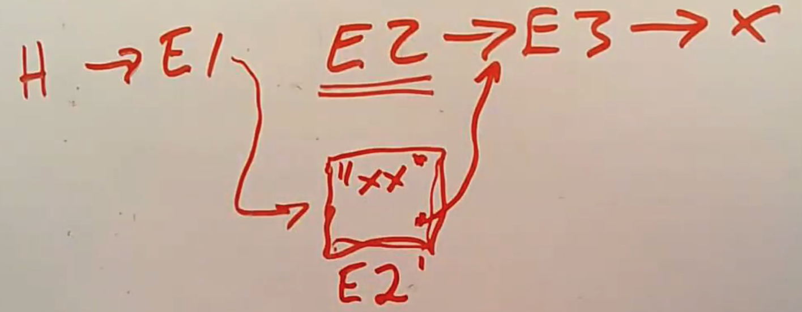

<!-- vim-markdown-toc GFM -->

* [引言](#引言)
* [自旋锁](#自旋锁)
* [读写锁](#读写锁)
* [RCU（Read Copy Update）](#rcuread-copy-update)
* [参考文献](#参考文献)

<!-- vim-markdown-toc -->

### 引言

在内核中往往不止一条逻辑控制流，例如多个CPU之间的并发、CPU与中断之间的并发，都需要我们使用某些手段来确保内核行为符合预期。

- 最简单的方式是使用锁，自旋锁（spinlock）是最简单的锁，它属于拍他锁，不管是读还是写，其临界区内只能有一条控制流，这样很损失性能。

- 读写锁（read-write-lock）允许在临界区有多个读线程，但只能有一个写线程，这在有许多读操作偶尔有写操作的情况下性能提升非常明显。但是读写锁会维护一个共享的引用计数，记录读线程的个数，这相当于每次读操作的时候仍然会有写操作，所以读写锁仍然不是内核理想的同步方式。

- RCU（Read Copy Update）是Linux上采用的同步多核CPU的方法，在频繁读但不是频繁写共享数据的场景下有特别好的性能优势。

下面对上述三种同步方法的实现分别进行介绍。以RISC-V架构下的XV6系统为例。

### 自旋锁

实现锁的关键是实现`acquire`接口，自旋锁的实现思路特别简单，就是一个死循环，不断检查锁是否被占用，当没被占用时获得锁，声明锁已被占用，然后返回。大致如下：

```c 
// spinlock definition

struct spinlock {
    unsigned int locked;
};

void bad_acquire(struct spinlock* l) {
    while (l) {
        if (l->locked == 0) {
            l->locked = 1;
            return;
        }
    }
}
```

上述`acquire`实现是有问题的，因为可能两个线程同时读到locked为0，然后都获取锁。解决方式是使用特殊的硬件指令保证一次test-and-set操作的原子性。RISC-V下的指令就是amoswap（atomic memory swap）。在C标准库中就是一个函数`__sync_lock_test_and_set`，它的行为就是交换两个参数的值，并返回第一个参数。这样，一个正确的acquire实现如下：
```c 
void
acquire(struct spinlock *lk)
{
  push_off(); // disable interrupts to avoid deadlock.

  // On RISC-V, sync_lock_test_and_set turns into an atomic swap:
  //   a5 = 1
  //   s1 = &lk->locked
  //   amoswap.w.aq a5, a5, (s1)
  while(__sync_lock_test_and_set(&lk->locked, 1) != 0) {}

  // Tell the C compiler and the processor to not move loads or stores
  // past this point, to ensure that the critical section's memory
  // references happen strictly after the lock is acquired.
  // On RISC-V, this emits a fence instruction.
  __sync_synchronize();
}
```

可以看到，这里除了对spinlock的改写，还一并添加了两个操作，`push_off`用来关闭中断，这是为了防止中断触发另一个控制流而可能造成死锁。`__sync_synchronize`是防止CPU的乱序执行，确保所有临界区的行为确实是在临界区执行。这两个操作在`release`接口都有相对应配合的调用。

`release`接口如下：
```c 
void
release(struct spinlock *lk)
{
  if(!holding(lk))
    panic("release");

  lk->cpu = 0;

  // Tell the C compiler and the CPU to not move loads or stores
  // past this point, to ensure that all the stores in the critical
  // section are visible to other CPUs before the lock is released,
  // and that loads in the critical section occur strictly before
  // the lock is released.
  // On RISC-V, this emits a fence instruction.
  __sync_synchronize();

  // Release the lock, equivalent to lk->locked = 0.
  // This code doesn't use a C assignment, since the C standard
  // implies that an assignment might be implemented with
  // multiple store instructions.
  // On RISC-V, sync_lock_release turns into an atomic swap:
  //   s1 = &lk->locked
  //   amoswap.w zero, zero, (s1)
  __sync_lock_release(&lk->locked);

  pop_off();
}
```
其中`__sync_lock_release`标准库函数也对应着RISC-V原子交换指令`amoswap`。

### 读写锁

读写锁通过允许多线程同时读共享变量来提升程序的并发能力。具体实现上，很容易想到，可以这样：
- lock值为0。可以读也可以写；

- lock值大于0。只能读，写操作必须等待lock变为0；

- lock值为-1。正在写，其他读写操作都要等待lock变为0。

按这样的思路代码实现如下：
```c 
struct rwlock {
    int n;
};

read_acqure(struct rwlock* l) {
    while (1) {
        x = l->n;
        if (x < 0) continue;
        if (CAS(&l->n, x, x + 1)) return;
    }
}

write_acqure(struct rwlock* l) {
    while (1) {
        if (CAS(&l->n, 0, -1)) return;
    }
}
```
其中`CAS`表示`Compare And Swap`代表一个特殊的原子指令，与上一节的原子指令类似。事实上，我在[无锁编程博客](https://literaryno4.github.io/cpp-lock-free-programming.html/)也用到过类似的指令，不管哪个架构的硬件，它们都会提供类似的指令来支持原子性的`Compare And Swap` 或者`test-and-set`，也就是读内存、改内存、写内存一条龙的原子性保障。这里面具体的实现细节包括：

- 多个处理器共用一个内存控制器。这样可以对一个特定地址加锁，然后让处理器执行2-3个指令，然后解锁；

- 如果处理器有缓存，那么缓存一致性协议会确保对于持有了想要更新的数据的cache line只有一个写入者，相应的处理器会对cache line 加锁，完成操作。

### RCU（Read Copy Update）

读写锁的问题是，虽然可以多线程同时读共享数据，但是会额外维护一个引用计数，记录有多少个线程在读共享数据。每次读操作都会修改引用计数，这仍然会消耗性能来确保缓存一致性。

RCU可以做到多线程读共享数据时几乎没有额外性能损耗（仅设置读标志和内存屏障）。这样能成功的原因在于对写操作的规定。顾名思义，我们不直接写共享数据，而是先创建新的要改写的数据，然后再把新创建改写的数据指向要改的数据。

以链表为例，我们要修改一个节点，首先创建一个新的节点，然后将新节点指向要修改的节点的下一个元素，最后才将修改节点前一个节点指向新创建的节点。这样，读操作要么读取到的是旧数据，要么是新数据，不会是修改一般的数据。比如改写一个链表的E2节点，示意图如下：



这里的一个问题是，何时释放旧的链表节点。当然是没有线程在读旧节点的时候，怎么知道呢？不会又来个引用计数吧，那不又重蹈覆辙了。RCU的做法是，先保证读操作的时候不会发生上下文切换，写操作的时候，等所有线程都发生了上下文切换的时候才释放旧节点。

以读写链表为例，代码如下：
```c 
// list reader:

rcu_read_lock()
e = head
while (p) {
    e = rcu_dereference(e)
    // read e->x 
    e = e->next
}
rcu_read_unlock()

// replace the first list element:
acquire(&lock)
old = head
e = alloc()
e-x = new_val;
e->next = head->next;
rcu_assign_pointer(&head, e);
release(&lock);

synchronize_rcu();
free(old)
```

可以发现，虽然读操作几乎不做任何事（rcu_read_lock仅设置标志位不让发生上下文切换），但是写操作会使用自旋锁，还要等待其他cpu核完成上下文切换，果然没有免费的午餐。

所以在Linux使用RCU的时候，会先进行性能测试，看看是否值得。也就是说是否读操作远远多于写操作。

### 参考文献

- [MIT6.S081](https://mit-public-courses-cn-translatio.gitbook.io/mit6-s081/lec14-file-systems-frans)
