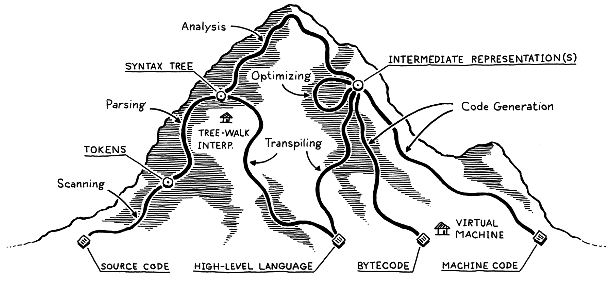
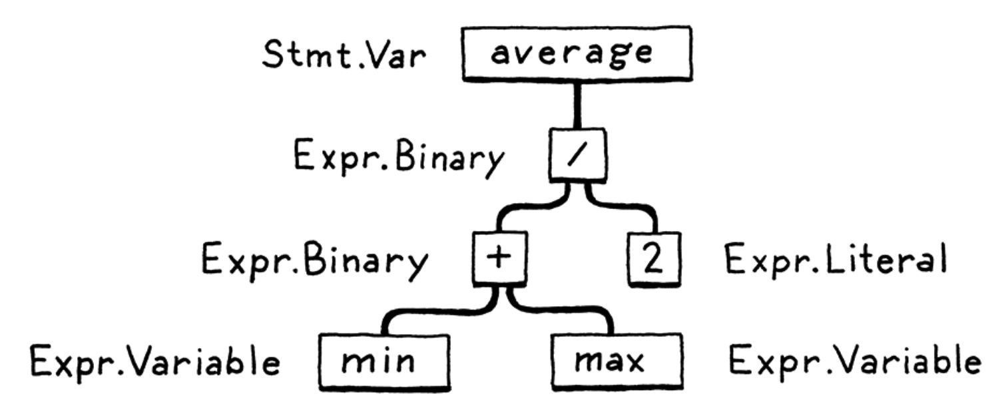
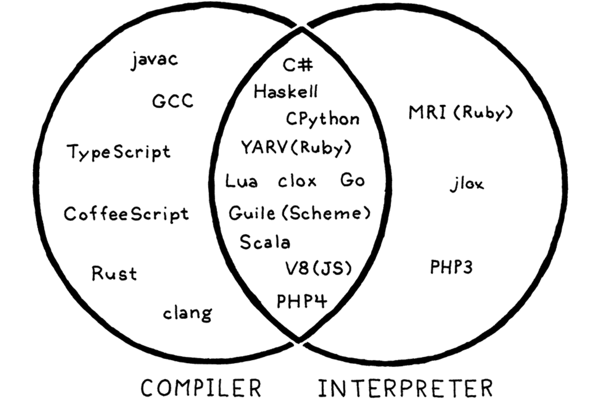
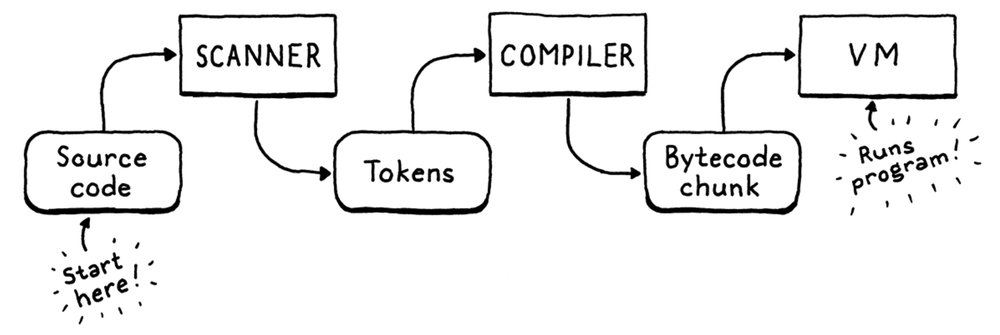

- [前言](#前言)
- [jlox：Java实现的基于抽象语法树遍历的解释器](#jloxjava实现的基于抽象语法树遍历的解释器)
- [clox：C语言实现的字节码虚拟机高性能编译器](#cloxc语言实现的字节码虚拟机高性能编译器)
- [Reference](#reference)

> 封面

### 前言

我最开始是从蒋炎炎的主页上看到他对《craftinginterpreters》的推荐的，去年就开始阅读，断断续续一直没有读完，今年终于有空闲时间继续把它读完。这是一本关于编译器的书，要说实际应用价值，除非专门做编译器方向，否则对个人的直接帮助可能不如去做一些OJ题目。然而，当我空闲下来，首先想到的就是继续读这本书。因为最开始当我第一次读这本书的时候，它的内容和编排方式就深深吸引我，这本书真的太好读了。在好读的基础上，它的内容不输编译器的圣经《龙书》深刻。当然这只是我的感觉，因为我虽然尝试渡过《龙书》，但第一章就没有读下去。《龙书》的最大缺点就是抽象的概念太多了，让人感觉学编译器像是在学数学，所以即便在我对编译器产生了足够的兴趣，想主动学习的时候，我也仅在读完个别小节后就放弃了。直到我再次看到蒋炎炎老师的推荐，仅仅是好奇看了看《craftinginterpreters》，我就有种想把它整本书读完的冲动，这是因为它：

- 重代码轻概念。这里只有娓娓道来的代码，所有必须用到的概念都是通过可以运行的代码来解释的，没有很确定性的定义。这种方式在其它比较新的国外教材上屡见不鲜，例如操作系统相关的《Operating System: Three Easy Pieces》，它的好处是让读者从实际的角度更具体地理解概念的本质。
- 代码详尽。任何读者，只要跟着作者读完这本书，就会有一个真正的可以跑起来的解释器（实际上是两个），读者和作者一起从头到尾分析需求，逐行写代码，没有任何省略。如果把作者比作导师，我从未见过如此耐心细致的。
- 零开始构建无依赖代码。书中代码不管是jlox还是clox的实现都只用到了相关语言的标准库，这样的最大好处就是简单，给读者极大的信心，原来编译器一点都不神秘，可以这么简单地就实现，这也是我个人能把这么厚的书看下去的原因。
- 是现代软件工程的一个优雅的示例。跟着作者逐行写代码，最终除了能收获对编译器相关知识的理解之外，我认为更大的收获是提升软件工程的能力，包括常见的设计模式、数据结构、算法、Java语言和C语言的灵活巧用，它几乎不会省略任何相关的知识，甚至有的讲得比专业书籍还鞭辟入里。你会不知不觉感叹，一个如此庞大的软件真的可以从0开始构建起来，没有任何技巧和魔法，有的只是每次着手写代码前耐心细致的分析和设计，本书绝对是一个软件工程设计的典范，值得所有写软件工程相关书籍的人学习。
- 现代。本书的内容比起传统的圣经专业书籍来说，它更为现代。作者作为谷歌的PL专家，它书中实现的解释器考虑得更为贴近现代的语言实现方式，例如Javascript的实现方式。在用C语言进一步提高性能时，作者采用字节码虚拟机的方式而不是机器码。很明显，作者想让我们看到像Lua、Python这样现代的语言的实现方式。如果对更现代的语言的实现方式感兴趣，而不是C语言，这本书尤其合适。

本文打算重点介绍书籍的设计思路，以加深自己对书中软件设计的理解，具体的代码书中讲得太详尽了，没有必要赘述。《craftinginterpreters》分为三部分，第一部分不必多说，介绍全书的概要和Lox语言语法；第二部分是用Java实现一个基于抽象语法树（AST）的解释器，该方法注重功能实现，几乎都是前端parser的内容，理解也比较简单，本文做简要介绍；第三部分是为了提升解释器性能而用C语言实现一个基于字节码虚拟机的解释器（编译器），我将着重介绍。

### jlox：Java实现的基于抽象语法树遍历的解释器

> jlox 中一条语句的AST表示

AST一般作为源代码在编译器的中间表示，它以对机器更友好的方法表征源代码。也就是说机器按照AST执行能代表源代码所有语义，它由parser生成，以树的结构表示在机器内存中，之后解释器或者后端能轻易执行或翻译它。对于jlox来说它是前者，即简单地通过后序遍历AST来执行代码。一个程序由若干语句组成，每个程序对应一个AST，因此执行程序的过程就可以理解成执行若干AST的过程。jlox的总体思路就这么简单，实际上写一个玩具解释器并没有想的那么难，多数工作围绕编译器的前端，即scanner、parser。scanner负责处理源代码，生成Token，parser则负责从Token生成AST。虽然书中为了教学和深入理解没有依赖任何工具，但scanner和parser都是由现成的工具可以生成的（例如GNU的Flex和Bison），也就是可以几乎不写任何代码就可以实现一个解释器。所以这部分的内容对实际工作可以说没有多大用处，很多课程书籍都直接使用了现成工具，但《craftinginterpreters》的作者还是没有任何省略耐心地手动地实现了scanner和parser，这就是零依赖的好处，它是一个去魅的过程，让读者的实现内没有任何黑盒和魔法。

jlox在工程上的价值大于在具体解释器实现的知识价值。作者在实现的过程中的错误处理、元编程和设计模式相关的思考特别值得学习。在错误处理时，如何尽可能早的抛出异常，如何用户友好地提示错误都值得思考；对于重复的代码，可以使用元编程来自动生成代码而不是繁琐的复制粘贴；为了提升可维护性和简洁性，可以使用与语言相关的设计模式（书中介绍的观察者模式）。jlox部分的内容主要是用详细的代码介绍编译器前端的相关概念和工程知识，它是用Java语言实现的，个人之前从未写过Java代码也能轻松都懂代码并自己跟着作者写了个jlox，可见这本书是有多么好读。接下来还是重点介绍clox。

### clox：C语言实现的字节码虚拟机高性能编译器

> 编译器和解释器的界线

个人倾向于把包含后端实现的解释器叫做编译器，我也不清楚边界在哪里。有人说直接解释执行的叫解释器，先编译成汇编代码再运行二进制代码的叫编译器。但现代的编译器在模糊两个概念的边界，它不会直接解释执行，而是先把源代码翻译成向汇编代码的字节码，然后让虚拟机执行这个字节码。这样做的最大好处就是性能的提升。AST需要内存保存一个特别大的树状数据结构，并且针对AST不好做优化，因此性能差，代码执行速度慢。现代解释器都很少直接用它，只有在一些代码静态分析工具、代码编辑器的高亮工具上会直接用它，例如LSP（Language Server Protocol）。这也容易理解，毕竟写代码的时候机器的CPU资源刚好是空闲的。

另外一个问题是，为什么多此一举要先将代码翻译成字节码呢，直接将代码翻译成机器码不是更快吗。是的，直接翻译成机器码更快，但缺点就是必须考虑所有机器的架构，为每种机器架构都写一个编译器后端。这样的工作量太爆炸了，想想GCC有多少版本，它积累了多久才有现在的体量。所以为了跨平台和移植性考虑，现代语言大多倾向于使用字节码虚拟机的方式。它在保证性能的同时还具有跨平台可移植的好处。

在clox中，scanner的功能和jlox一样，用于生成Token，不同的是clox按需生成Token，也就是clox边执行边让scanner生成Token，而jlox是一次性生成代码的所有Token，显然clox更高效，节省内存空间。接着clox将Token传给compiler，compiler负责将token转化为字节码，同时保存常量等信息。最后clox将字节码传给虚拟机（VM），VM负责翻译执行字节码。

> clox的pipeline

scanner的细节不必多说，可以将它看作一个有限状态机，逐字符扫描源代码。compiler是clox的关键，它把scanner生成的Token转成字节码（和代码中的常量），字节码都被保存在chunk结构体内，它本质是一个动态数组，随着代码的执行增加，同时lox程序的常量被保存在chunk中的常量动态数组中。因此，compiler的工作就是维护chunk这个结构体。而对于变量，由于其会跟着VM对chunk中的字节码的执行而改变，在hash table（书中从零开始写的，很好的哈希表教程）中保存，由VM维护。

总的来说，clox由scanner、compiler和VM三个部分组成，lox的语法特性（如函数、闭包、类、继承、垃圾回收机制）实现就是往compiler的chunk中写入更多的代码翻译细节，以及让VM动态维护更多的语法相关的数据结构（如变量、作用域）。

### Reference

- [craftinginterpreters](https://craftinginterpreters.com/)
- [蒋炎炎的主页](https://jyywiki.cn/)