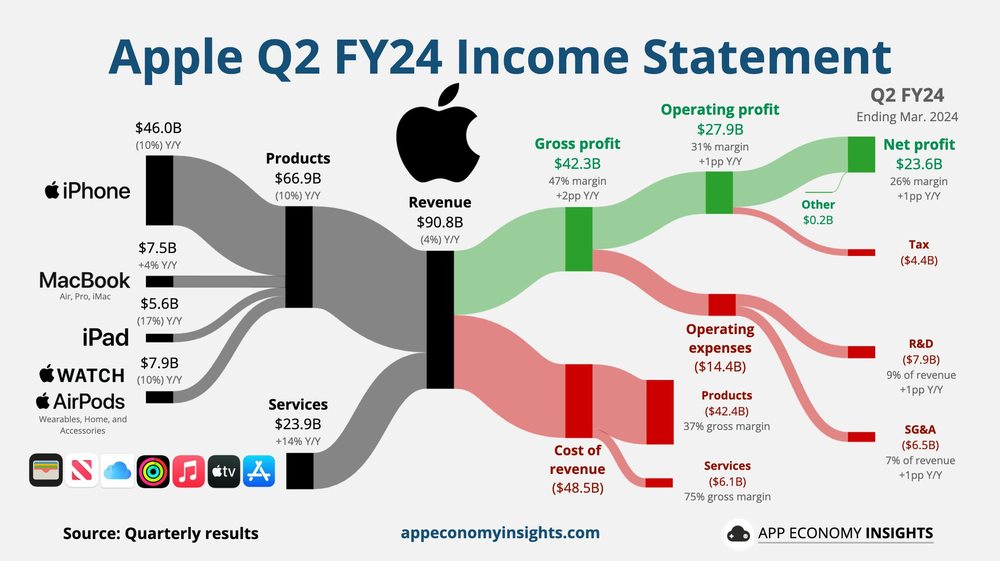
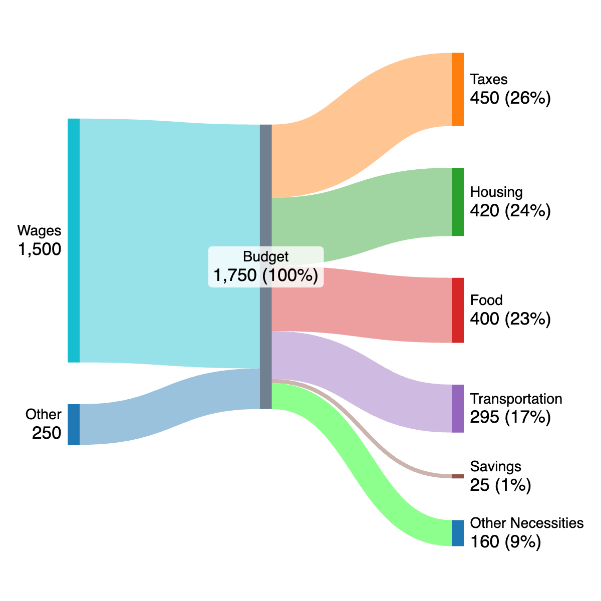

好久没更新blog了，这次也只是简单分享下一个小工具。

最近在关注企业的financial statements，在X上发现一个很美观的图：

> 来源：[appeconomyinsights](https://www.appeconomyinsights.com/p/how-to-analyze-a-10-k)

我发现这种图能很直观的反应资金的流向，公司赚了多少，花了多少，利润又有多少，全反应在图中了，真是一图胜千言。对我个人而言，拿桑基图做预算再合适不过了，个人的预算相当于公司的财务嘛，能直观反应自己收入、开支、储蓄的分布情况，以便及时发现自己财务上的问题，做出合理调整。

后来查了半天才发现这叫桑基图（sankey diagram），数据可视化常用的工具，相见恨晚啊。

以下是我发现有用的资源：

- https://www.sankey-diagrams.com。网站上分享了很多桑基图的用例，还分享了[画桑基图的软件](https://www.sankey-diagrams.com/sankey-diagram-software/);

- https://sankeymatic.com。我发现这个是最好用的；

- https://blog.literaryno4.win/sankeymatic/build。 我部署到自己网站的sankeymatic分支，画的图可以显示百分比，以后就打算用这个了。

画出来效果大概是这样的（只是简单demo）：

